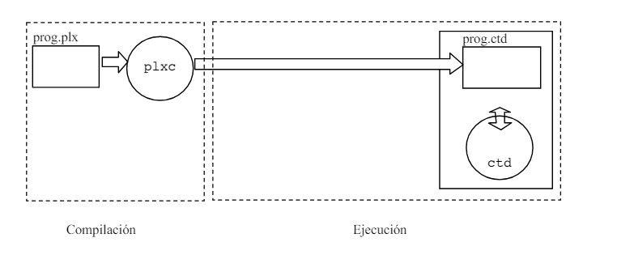
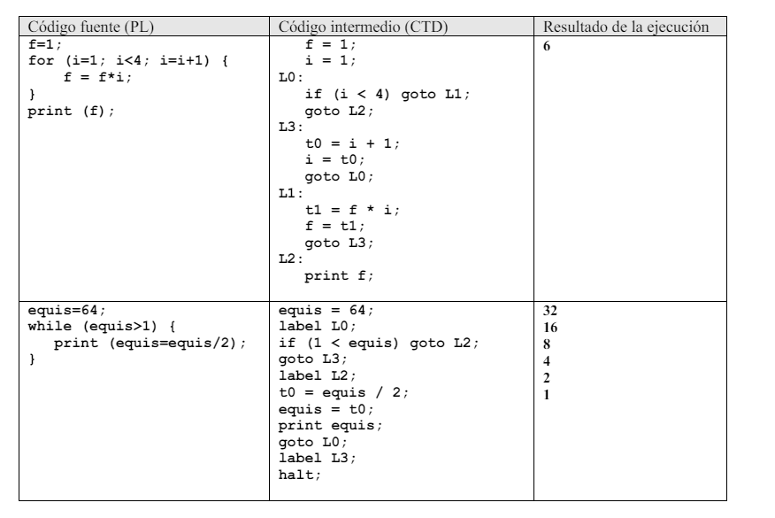

# Compilador_PLXC
Este repositorio sirve para guardar la realización de un proyecto universitario que consiste en la construcción de un compilador con JFLex y CUP de un lenguaje de programción similar a C.

Para ser más exactos, requiere la traducción de este lenguaje a un lenguaje intermedio definido mediante instrucciones de tres direcciones, que finalmente se interpretará con otro programa que simule su ejecución.

Aquí hay una pequeña representación del esquema de compilación en Java:


No es el proyecto del que esté más orgulloso, tiene bastante por mejorar, pero no viene mal tenerlo guardado en un repositorio de github
por si en algún futuro quiero retomarlo, para tener un refresco o una base por la que empezar.

## El código fuente
El lenguaje fuente tiene una sintaxis similar a C o JAVA y consiste en una lista de sentencias. El lenguaje BASE
no requiere la declaración de variables, ya que considera que todas las variables, y considera que todas las
variables están definidas y tienen asignado un valor inicial 0. El lenguaje BASE puede contener expresiones
aritméticas simples (suma, resta, multiplicación y división); expresiones de asignación; y expresiones
relacionales (menor, mayor, igual, etc.); así como sentencias de control if, if-else, while, do-while y for y
una sentencia print de salida. Por ejemplo, el siguiente es un programa válido en PL:

Desde el punto de vista léxico, las reglas para componer los identificadores, las constantes numéricas, y
demás elementos del lenguaje, son las mismas que en el lenguaje C o JAVA

Ahora, en describiremos la extensión que se subirá a este repositorio

### La extensión
La extensión consiste en la implementación mediante JFlex y Cup de una extensión del compilador del
lenguaje PLX. La aportación de esta extensión es el uso de variables de tipo boolean, la introducción de
nuevos operadores condicionales y algunas nuevas sentencias de control. Se suponen previamente
implementadas la funcionalidad básica del lenguaje PLX y sus sentencias de control. El código intermedio
generado por ambos lenguajes es el mismo y el esquema de compilación también.

Se incluyen varios elementos, entre los que están la asignación de varios tipos (int, float, boolean, char y string) casting a esos tipos,
operaciones entre esos tipos, uso de arrays incluyendo declaraciones y asignaciones varias,.

## El código objeto (tres direcciones)

El código objeto esta formado por una secuencia de sentencias de código intermedio que se obtienen a
partir de un conjunto reducido de instrucciones de tres direcciones, que operan sobre constantes de
números enteros o variables enteras. Todas las variables del código intermedio se considera que están
previamente definidas y que su valor inicial es 0.

El conjunto de instrucciones del código ensamblador, y su semántica son las siguientes (no implementado al completo en el código):

| Instrucción          | Acción                                                                                   |
|----------------------|------------------------------------------------------------------------------------------|
| `x = a ;`            | Asigna el valor de a en la variable x                                                      |
| `x = a + b ;`        | Suma los valores de a y b, y el resultado lo asigna a la variable x                       |
| `x = a - b ;`        | Resta los valores de a y b, y el resultado lo asigna a la variable x                      |
| `x = a * b ;`        | Multiplica los valores de a y b, y el resultado lo asigna a la variable x                 |
| `x = a / b ;`        | Divide (div. entera) los valores de a y b, y el resultado lo asigna a la variable x        |
| `x = a +r b ;`       | Suma de dos valores reales                                                                |
| `x = a -r b ;`       | Resta de dos valores reales                                                               |
| `x = a *r b ;`       | Multiplicación de dos valores reales                                                      |
| `x = a /r b ;`       | División de dos valores reales                                                            |
| `x = (int) a ;`      | Convierte un valor real a en un valor entero, asignándoselo a la variable x               |
| `x = (float) a ;`    | Convierte un valor entero a en un valor real, asignándoselo a la variable x               |
| `x = y[a] ;`         | Obtiene el a-ésimo valor del array y, asignando el contenido en x                         |
| `x[a] = b ;`         | Coloca el valor b en la a-ésima posición del array x                                       |
| `x = *y ;`           | Asigna a x el valor contenido en la memoria referenciada por y                             |
| `*x = y ;`           | Asigna el valor y en la posición de memoria referenciada por x                             |
| `x = &y ;`           | Asigna a x la dirección de memoria en donde está situado el objeto y                       |
| `goto l ;`           | Salto incondicional a la posición marcada con la sentencia “label l”                        |
| `if (a == b) goto l ;` | Salta a la posición marcada con la sentencia “label l”, si y solo si a es igual que b     |
| `if (a != b) goto l ;` | Salta a la posición marcada con la sentencia “label l”, si y solo si a es distinto que b  |
| `if (a < b) goto l ;`  | Salta a la posición marcada con la sentencia “label l”, si y solo si a es menor que b     |
| `l:`                  | Indica una posición de salto                                                              |
| `label l ;`           | Indica una posición de salto (forma sintáctica equivalente a la anterior)                  |
| `end f ;`             | Indica el final del código de una función                                                  |
| `param n = x;`        | Indica que x debe usarse como parámetro n-ésimo en la llamada a la próxima función         |
| `x = param n ;`       | Asigna a la variable x el valor del parámetro n-ésimo definido antes de la llamada a la función |
| `return ;`            | Salta a la posición inmediatamente siguiente a la de la instrucción que hizo la llamada (call f) o (gosub l) |
| `write a ;`           | Imprime el valor de a (ya sea entero o real)                                               |
| `writec a ;`          | Imprime el carácter Unicode correspondiente al número a                                     |
| `print a ;`           | Imprime el valor de a, y un salto de línea                                                 |
| `printc a ;`          | Imprime el carácter Unicode correspondiente al número a, y un salto de línea               |
| `error ;`             | Indica una situación de error, pero no detiene la ejecución                                |
| `halt ;`              | Detiene la ejecución. Si no aparece esta instrucción, la ejecución se detiene al alcanzar la última instrucción de la lista |
| `# ….  `              | Cualquier línea que comience con # se considera un comentario                              |
| `. <nombre fichero>`  | Incluye el contenido del fichero indicado, buscándolo en el directorio actual              |

Desde un punto de vista meramente sintáctico, el código intermedio se representa mediante un fichero de
texto en el cual cada sentencia ocupa exactamente una línea. Todas las instrucciones de código intermedio
terminan en punto y coma. Los nombres de las variables comienzan siempre por una letra (mayúscula o
minúscula), seguida de una o mas letras o números. Estas mismas reglas se usan para los nombres de las
etiquetas. Se excluyen como nombres validos de variables y etiquetas las palabras reservadas del lenguaje
intermedio. En los ejemplos siguientes se muestra el código fuente en PL, el correspondiente código
intermedio en formato CTD y el resultado de la ejecución del mismo:




## Gramática base del lenguaje
Programa -> Sentencia_comp <br>
Sentencia_comp -> { Lista_de_sent} <br>
Lista_de_sent -> ε <br>
| Lista_de_sent Sent <br>
Sent -> Sentencia_simp <br>
| Sentencia_comp <br>
Sentencia_simp -> ; <br>
| List_declar_var ; <br>
| Declar_tipo ; <br>
| Expresion ; <br>
| Sent_if <br>
| Sent_while <br>
| Sent_do_while <br>
| Sent_for <br>
| Sent_switch <br>
| Sent_print ; <br>
List_declar_var -> Tipo IDENT <br>
| List_declar_var , IDENT <br>
Declar_tipo -> typedef Tipo IDENT <br>
Tipo -> int <br>
| char <br>
| IDENT <br>
Sent_if -> if ( Condicion ) Sent Else_if <br>
Else_if -> elseif ( Condicion ) Sent Else_if <br>
|else Sent <br>
| ε <br>
Sent_while -> while ( Condicion ) Sent <br>
Sent_do_while -> do Sent while ( Condicion ) ; <br>
Sent_for -> for ( Expresion ; Condicion ; Expresion ) Sent <br>
Sent_switch -> switch ( Expresion ) { Lista_switch Opt_default } <br>
Lista_switch -> case ENTERO : Sent break ; <br>
| Lista_switch case ENTERO : Sent break ; <br>
Opt_default -> default : Sent break ; <br>
| ε <br>
Sent_print -> print Expresion <br>
Bin_op -> + | - | * | / | % <br>
Expresion -> Expresion Bin_op Expresion <br>
| - Expresion <br>
| ( Expresion ) <br>
| Condicion signo_? Expresion : Expresion <br>
| Variable = Expresion <br>
| ENTERO <br>
| CARACTER <br>
| Variable <br>
| ++Variable <br>
| Variable++ <br>
| --Variable <br>
| Variable-- <br>
Variable -> IDENT <br>
Rel_op -> < | <= | >= | > | == | != <br>
Condicion -> Expresion Rel_op Expresion
| Condicion && Condicion
| Condicion || Condicion
| ! Condicion
| ( Condicion )
| true
| false

## Implemantación y uso
Se incluye en el proyecto un pequeño archivo en bash para hacer más ameno el proceso de compilación.
También se incluye el programa `ctd` que es un intérprete de código intermedio para poder comprobar la salida del programa.

Bastaría con ejecutarlo de la siguiente forma:
```bash
   ./comp.sh
```
Si se desea hacer manualmente, los comandos serían los siguientes:

1. Ejecutar JFlex:

```bash
jflex PLXC.flex
```
2. Ejecutar CUP:

```bash
cup PLXC.cup
```

3. Compilar los archivos Java resultantes:

```bash
javac *.java
```
4. Compilar y ejecutar el programa:
```bash
java PLXC prog.plx prog.ctd
./ctd prog.ctd
```
Si alguno de los ficheros no tiene permisos de ejecución se le puede asignar de forma muy sencilla utilizando "chmod"
```bash
chmod +x archivo.a
```
